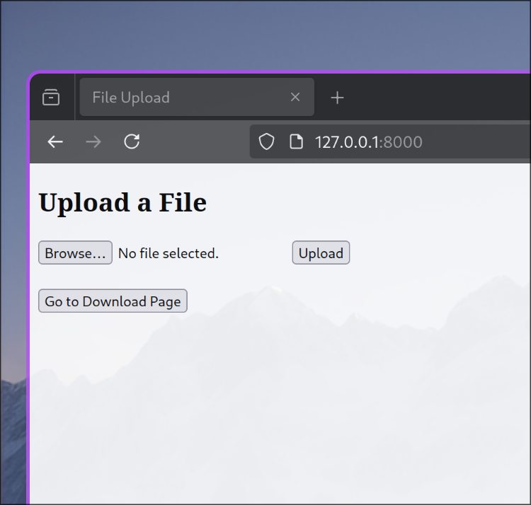
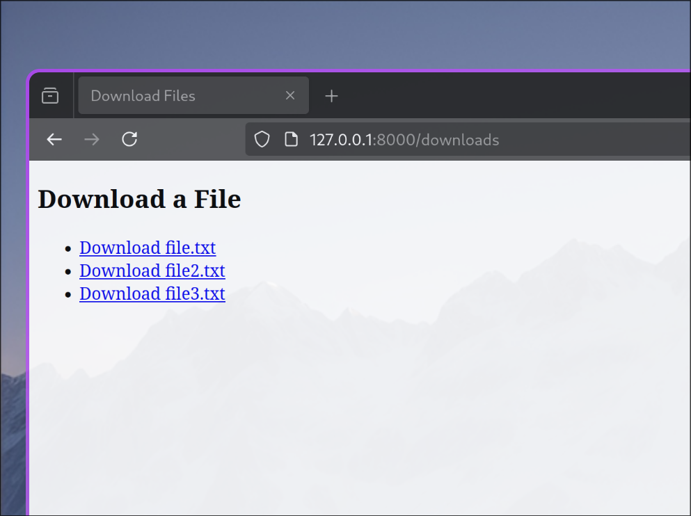

# file-server
Simple file server to share files between 2 devices.

*You need to be connected to the same WiFi network on the 2 devices*

Firstly, you need to run the server.
```bash
python server.py
```

You will get this output:
```bash
Server started at http://your_local_ip_addr:8000
```

Simply connect to the *your_local_ip_addr* and specify the port number

Like so:
```http://your_local_ip_addr:8000```

You can then choose to upload files from your connected device, and those uploaded files will be found in the ```uploads``` directory on the host device
<p align="center">
  
</p>

Or you can download files on your connected device, the files you will be downloading will need to be in the ```downloads``` folder on your host device
<p align="center">
  
</p>
